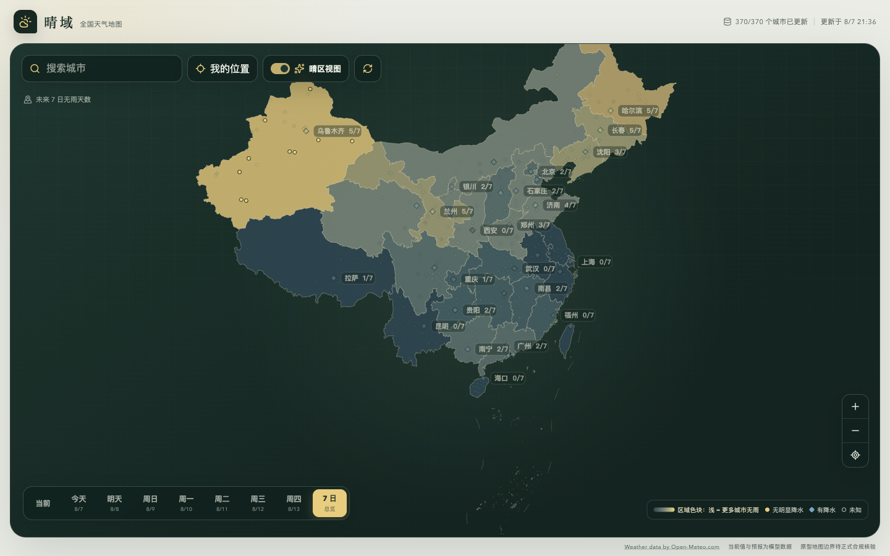

# 晴域 · 全国天气地图

一张以全国视野查看当前与未来七天天气的中国地图。

线上版本：<https://qingyu-weather-map.haruhowell.workers.dev>



## 它解决什么问题

当一个城市未来几天持续下雨时，用户需要先快速看到“哪一大片区域更值得继续查看”，再点开
具体城市了解天气。晴域只呈现机械、可核验的天气信息，不替用户做旅游推荐，也不包含路线、
高铁、航班或票价能力。

## 当前能力

- 全国 370 个城市的当前与未来 7 日天气地图
- 省级晴雨底色：浅暖色表示该区域有更多城市无明显降水
- “有晴窗”筛选：默认高亮至少连续 2 天无明显降水的城市，可调整为连续 3/4 天
- 城市标签直接可点击，打开桌面详情侧栏或移动底部面板
- 城市标签使用 emoji + 数值，例如 `乌鲁木齐 🌤️ 5/7`
- 当前、单日、7 日总览三种时间视图
- 七日无雨天数与最长连续无雨天数
- 城市搜索、键盘操作和按需定位
- 分批天气请求、局部失败、过期缓存和可恢复重试
- 响应式桌面/移动布局与 Open-Meteo 数据署名

## 本地运行

需要 Node.js 22 或更新版本。

```bash
npm install
npm run dev
```

开发服务器默认位于 `http://127.0.0.1:4173`。

## 质量检查

```bash
npm test
npm run lint
npm run build
```

GitHub Actions 会在 push 和 pull request 时自动运行同样的检查。

## 发布到 Cloudflare

项目使用 Cloudflare Workers Static Assets，无需单独后端。

```bash
npx wrangler login
npx wrangler whoami
npx wrangler deploy --dry-run
npm run deploy
```

发布配置位于 `wrangler.jsonc`，Worker 名称为 `qingyu-weather-map`。需要回滚时，
可在 Cloudflare 控制台的 Workers & Pages → Deployments 中选择上一版本。

## 天气判定规则

“无明显降水”定义为：预计日降水量 `< 0.2 mm`，且降水时数 `<= 1 小时`。缺失字段始终为
未知，不会被当成无雨。

七日模式里的 `x/7` 表示未来 7 天中被判定为无明显降水的天数；字段缺失仍保留在分母中，
不会被算作无雨。“有晴窗”则使用连续无雨天数作为单独筛选条件。emoji 是快速视觉提示，
详情面板才是完整的温度、降水概率、湿度和风速信息。

## 数据与发布边界

- 天气来自 [Open-Meteo](https://open-meteo.com/)。免费端点适合非商业原型，页面保留
  `Weather data by Open-Meteo.com` 署名；商业化前需要重新确认套餐、许可和可用性。
- 全国摘要按 50 城一批、最多三批并发；单批失败时保留其他城市及可用缓存。
- 所有日期统一使用 `Asia/Shanghai`。
- 当前 GeoJSON 只用于产品原型。公开商业发布前必须完成地图边界、审图号与数据许可核验。

更完整的数据来源与限制见 [`docs/data-sources.md`](docs/data-sources.md)。

## 项目结构

```text
src/components/     地图、工具栏、城市详情与响应式 UI
src/hooks/           天气数据、城市详情、定位生命周期
src/lib/map/         城市视觉编码、区域底色、标签与最近城市
src/lib/weather/     Open-Meteo 适配、规范化、缓存与无雨规则
public/data/         城市中心点与原型 GeoJSON
docs/                产品需求、技术计划、数据来源与视觉方案
wrangler.jsonc       Cloudflare Workers Static Assets 配置
```

## 还没有做的事

以下方向需要产品决策后再做：收藏/对比城市、按出发日期查看晴窗、交通信息跳转、更多区域
统计、海外城市与自定义天气数据源。当前版本刻意不做自动目的地推荐。
