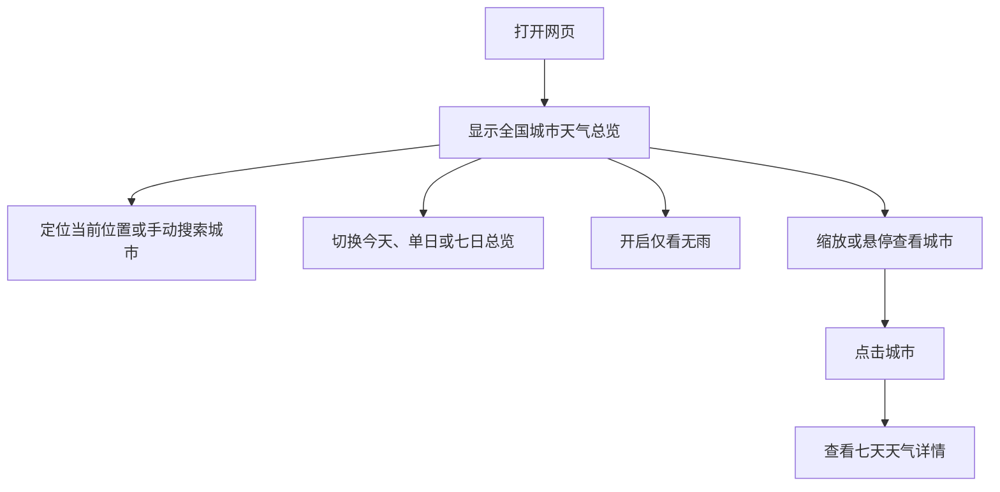

# 全国天气地图（第一版）产品需求

## Problem Frame

用户已经知道自己的出发地，希望在未来一周内快速查看全国不同城市的天气分布，
自行判断可能前往的目的地。产品的职责是把客观天气信息清晰、完整地铺在地图上，
而不是推荐目的地、规划行程或整合交通交易信息。

第一版的核心价值是：打开网页后，无需阅读列表或回答多轮问题，就能在一个全国视图
中感知哪里有雨、哪里无雨、温度如何，并能进一步查看任一城市的七天天气。

## User Flow

## Requirements

**全国地图与信息密度**

- R1. 默认首屏必须显示完整中国地图，并以行政区板块提供清晰的地理结构。
- R2. 全国视角必须为所有已覆盖的地级市显示天气色点；主要城市额外显示名称和
  温度，避免数百个文字标签重叠。
- R3. 地图必须支持缩放、平移和悬停。放大后逐步显示更多城市名称、温度和天气
  图标，最终能够识别视野内的全部城市。
- R4. 省级板块只承担空间结构与交互反馈，不得用单一省级颜色冒充省内所有城市
  的天气状态。

**天气时间与表达**

- R5. 产品必须提供当前天气、今天、未来第 2 至第 7 天和“未来七日总览”。
  首屏默认未来七日总览，即按中国标准时间计算的今天至第 6 天。
- R6. 单日模式下，城市点必须表达该日是否有明显降水，并可读出最高、最低温度。
- R7. 七日总览默认显示每个城市的无雨天数，例如 `6/7`；不得自动生成旅行推荐分。
- R8. “突出无雨”在当前模式中突出此刻无降水的城市，在单日模式中突出该日无
  明显降水的城市，在七日总览中只突出 `7/7` 无明显降水的城市。其他城市淡出
  而非从地图结构中消失。
- R9. 无雨判断规则必须透明：第一版将日累计降水量小于 `0.2 mm` 且预计降水时长
  不超过 `1 小时` 视为“无明显降水”。界面应说明该口径是天气预报判断，不是承诺。
- R9a. 任一判断字段缺失时，该城市当日必须标记为“未知”，不得按 `0` 处理或计入
  无雨天数；七日数据不足时仍使用固定分母 `7` 并明确缺失天数。
- R10. 界面必须显示数据更新时间与天气数据来源。

**位置、搜索与城市详情**

- R11. 用户点击定位按钮后可授权浏览器获取当前位置；首屏不得主动弹出权限请求。
  拒绝授权、超时、超出覆盖范围或定位失败时，地图与搜索仍可正常使用。
- R12. 用户可手动搜索城市。选择搜索结果后，地图定位并选中对应城市。
- R13. 悬停城市点时必须显示城市名、当日天气、温度和降水信息。
- R14. 点击城市后必须打开详情面板，展示当前天气与未来七天逐日天气，包括天气
  状况、最高最低温度、降水量、降水概率、风速和湿度。
- R14a. 切换日期、开启筛选或刷新天气时必须保留地图视口、选中城市和详情面板；
  不符合当前筛选的已选城市仍保持选中，并明确说明其不符合筛选。
- R15. 第一版城市详情只呈现客观天气，不提供景点、行程、交通或目的地推荐。

**状态、响应式与可用性**

- R16. 首次加载、天气更新、定位、无数据和上游天气服务失败必须有清晰状态；
  失败时保留地图和城市搜索，并提供重试。
- R17. 桌面端以地图为主、右侧详情为辅；移动端地图保持主视图，详情改为底部抽屉。
- R17a. 移动端不得依赖 Hover；点按城市必须直接选中并打开详情抽屉。地图需要可
  触摸的放大、缩小和重置全国按钮。
- R18. 颜色不得成为唯一的信息载体；有雨、无雨和未知状态同时使用形状、描边或
  文字符号区分，并提供图例。
- R19. 所有按钮、搜索和日期控件必须支持键盘操作与可见焦点状态。
- R19a. 由于地图使用 Canvas 渲染，产品必须通过城市搜索结果或同步的可访问城市
  列表，让键盘与读屏用户能够访问任一城市，而不是让数百个点进入 Tab 顺序。
- R20. 第一版覆盖中国大陆地级市，并纳入香港、澳门和台湾的主要城市天气点；
  未覆盖地区必须明确标记为数据缺失。
- R21. 全国天气部分失败时，成功城市继续显示，失败城市保留为灰色未知状态，并
  显示类似“312/337 个城市已更新”的覆盖进度；有过期缓存时先显示旧值并后台刷新。

## Success Criteria

- 用户无需进入详情即可在全国视角感知无雨、有雨和温度的空间分布。
- 全国地图稳定呈现数百个城市天气点，主要标签在常见桌面尺寸下没有大面积重叠。
- 用户能在三次以内操作完成“切换日期 → 筛选无雨 → 查看城市七天天气”。
- 定位被拒绝、天气 API 超时或部分城市缺失时，应用不会白屏或阻断其他功能。
- 桌面和移动视口均能完成全部核心操作。

## Scope Boundaries

- 不做 AI 目的地推荐、城市排名或综合旅行评分。
- 不做景点、美食、酒店、行程生成等旅游助手功能。
- 不做驾车时间、路线规划、高铁、航班、机票价格或任何交通跳转。
- 不做天气雷达、台风路径、分钟级降水或专业气象分析。
- 不做全球或海外地图；第一版聚焦中国全国视图。
- 不做账户、收藏、分享、通知或个性化偏好。

## Key Decisions

- 地图优先而非答案卡片优先：用户明确希望自行判断，不接受黑盒推荐。
- 全国视角采用“全部城市色点 + 渐进标签”：兼顾一览全国与数百城市的信息密度。
- 七日总览采用无雨天数：比二元的“整周无雨”提供更多客观信息，同时不引入推荐。
- 交通完全延后：先验证地图、天气数据与交互的基础质量。
- 第一版允许前端直连公开天气服务，并在客户端做短时缓存；商业化或访问量增长后
  再评估边缘代理与商业数据授权。

## Dependencies / Assumptions

- 天气预报存在不确定性，所有“无雨”表达都应使用“预计”或“无明显降水”。
- 公开天气服务和地图边界数据可能存在速率、授权与更新限制，正式商业化前需要
  重新核对许可并替换为适合生产的服务等级。
- 公开展示中国地图需要完成地图来源、边界表达和审图信息的合规核验。

## Outstanding Questions

### Deferred to Planning

- [Affects R1-R4][Needs research] 选择能支持全国板块、城市散点和渐进标签的地图
  渲染方案，并确定第一版地图边界数据来源。
- [Affects R5-R10][Needs research] 确认公开天气 API 的多坐标查询、缓存和失败降级
  策略。
- [Affects R17][Technical] 确定桌面详情面板与移动底部抽屉的组件结构。

## Next Steps

→ `/ce:plan` 制定技术方案并进入实现。
