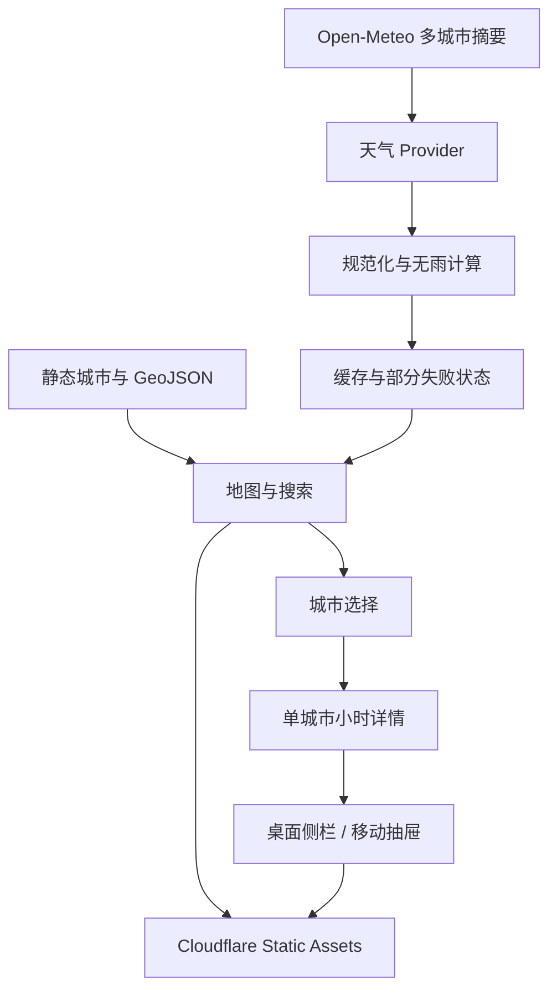

# feat: 构建全国天气地图第一版

## Overview

从空白工作区构建一个可直接发布的中国全国天气地图。首屏默认展示今天至第 6 天的
七日总览，全国城市以天气点呈现，主要城市显示名称和 `x/7` 无雨天数；用户可切换
当前或单日、突出无雨、搜索和定位城市，并打开城市七天天气详情。

产品只呈现客观地图与天气信息，不提供目的地推荐、旅游内容或综合交通规划；城市详情允许按需查询中国境内驾车估算
（见 origin: `docs/brainstorms/2026-08-07-china-weather-map-requirements.md`）。

## Problem Frame

用户需要在一个全国视图中快速观察未来一周的天气与温度，自行决定想进一步了解
哪个城市。信息密度、数据状态透明度和地图交互质量比自动推荐更重要。

当前工作区为绿地目录：没有源码、包管理、Git、设计系统或托管配置，因此计划需要
同时建立前端结构、地图与城市数据、天气适配层、测试和 Cloudflare 发布配置。

## Requirements Trace

- R1-R4：全国行政区板块、全部城市天气点、缩放平移和渐进标签。
- R5-R10：当前/单日/七日模式、无雨天数、透明规则、来源和更新时间。
- R11-R15：按需定位、城市搜索、模式感知 Tooltip 与天气详情。
- R16-R21：部分失败、过期缓存、响应式、移动触控、无障碍与覆盖进度。
- Success：不超过三次操作完成“切换日期 → 突出无雨 → 查看详情”，失败不白屏。

## Scope Boundaries

- 不实现 AI、推荐、排名、旅行评分、景点或行程。
- 不实现海外驾车、高铁、航班、票价或任何交通跳转；仅在中国城市详情中按需调用高德驾车估算。
- 不实现后端账户、持久化用户数据、通知或分享。
- 不实现天气雷达、分钟级降水、台风或专业气象能力。
- 天气地图支持中国、中国 + 周边与海外三档范围；海外只展示天气，不提供自驾估算。
- 不把原型地图边界数据声明为已完成审图或正式商业合规。

## Context & Research

### Relevant Code and Patterns

- 工作区无既有代码模式，采用绿地结构。
- Node.js 22、npm 与 Wrangler 已可用；本机 Wrangler OAuth 已确认登录 Cloudflare。
- Cloudflare 账户中没有同名 `sunward-weather-map` 项目，可创建独立 Worker；旧的 Qingyu Worker 入口保留兼容。

### External References

- Open-Meteo Forecast API 支持多坐标、当前天气与最多 16 天的日预报：
  https://open-meteo.com/en/docs
- Open-Meteo 免费端点仅适合非商业用途并要求 CC BY 4.0 署名：
  https://open-meteo.com/en/license
- ECharts `registerMap`、`geo` 与 geo scatter：
  https://echarts.apache.org/en/api.html#echarts.registerMap
- ECharts Canvas 适合 geo/scatter 元素：
  https://echarts.apache.org/handbook/en/best-practices/canvas-vs-svg/
- Cloudflare 新静态项目优先 Workers Static Assets：
  https://developers.cloudflare.com/workers/static-assets/get-started/

## Key Technical Decisions

- **React + TypeScript + Vite：** 绿地单页应用不需要服务端渲染或路由，选择最小静态
  前端栈，保持本地开发和 Cloudflare 构建简单。
- **ECharts Canvas：** 使用注册 GeoJSON 的 `geo` 提供行政区结构，普通 scatter
  承载约 300-400 个城市点。该数量低于 ECharts large/progressive 阈值，不开启
  `large`，以保留逐点形状、颜色、Tooltip 和点击。
- **两层城市系列：** 全部城市点始终存在；主要城市和符合当前缩放级别的城市由独立
  标签系列显示，并使用碰撞隐藏。优先级为选中/定位城市、直辖市省会、其他城市。
- **Open-Meteo Provider 隔离：** 领域层只消费规范化天气模型，具体 API 位于独立
  provider。全国摘要按每批 50 个城市、最多 3 批并发、`Promise.allSettled` 拉取；
  单批失败不会清空其他成功数据。
- **日级字段计算无雨：** 使用 `precipitation_sum < 0.2 mm` 且
  `precipitation_hours <= 1`。任何字段缺失均为 unknown；`0.2` 本身不是无雨。
- **详情按需取小时数据：** 全国摘要不请求逐小时数组；只有选中城市后才请求小时
  湿度与降水概率并按天聚合，控制首屏体积与上游请求量。
- **固定中国标准时间：** 所有全国日期使用 `Asia/Shanghai`，七日为今天至 D+6；
  跨午夜刷新数据但保留视口、筛选和选中城市。
- **客户端缓存与 stale-while-refresh：** 规范化摘要存入 localStorage，30 分钟内
  视为 fresh，之后先显示 stale 并后台更新；缓存损坏时忽略而非阻断页面。
- **显式可访问替代面：** Canvas 不让数百城市进入 Tab 序列；城市搜索支持键盘访问
  任一城市，详情和当前模式通过语义化 DOM 与 `aria-live` 对读屏可见。
- **Workers Static Assets：** 首版没有后端，`dist` 通过 `wrangler deploy` 发布。
  保留未来新增 `/api/*` 边缘缓存的升级路径，但不在本次实现。
- **边界数据为可替换静态资产：** 原型使用带来源记录的全国 GeoJSON 和城市中心点。
  渲染层不绑定来源，正式商业发布前必须替换或核验为符合地图法规的来源。

## Resolved Planning Questions

- 默认模式：未来七日总览，突出无雨关闭，全国视图。
- “当前天气”语义：Open-Meteo 15 分钟模型当前值，不表述为气象站实测。
- 七日温度表达：地图标签只显示 `x/7`；Tooltip 展示七日最低至最高温区间。
- 筛选文案：使用“突出无雨”，因为其他城市只是淡出，不会消失。
- 当前位置作用：显示我的位置、居中并选择最近的受支持城市；中国境内定位可作为自驾估算起点，不上传或持久化
  状态，且仅在点击定位按钮后请求权限。
- 移动点按：单击城市直接选择并打开底部详情，不设置双阶段 Hover 流程。
- 天气数据失败：按城市/批次保持 `fresh | stale | error | unknown`，成功数据继续显示。

## Deferred to Implementation

- 全国 GeoJSON 的最终压缩精度：在实现时根据包体与视觉效果选择，保留来源文件。
- 标签分档的精确 zoom 阈值：通过本地截图观察长三角、珠三角和全国视图后微调。
- Open-Meteo 单批 URL 的实际最佳城市数：先按 50，实现时以真实响应长度和超时验证。

## High-Level Technical Design

> 此图用于说明预期的数据流和组件边界，是评审方向，不是需要逐字复制的实现规格。

## Implementation Units

- [x] **Unit 1: 前端骨架、静态地图与城市数据**

**Goal:** 建立可构建的 Vite React 项目，准备全国 GeoJSON、城市中心点和来源说明。

**Requirements:** R1-R4, R20

**Dependencies:** 无

**Files:**
- Create: `package.json`
- Create: `vite.config.ts`
- Create: `tsconfig.json`
- Create: `index.html`
- Create: `src/main.tsx`
- Create: `src/App.tsx`
- Create: `src/styles/globals.css`
- Create: `scripts/prepare-map-data.mjs`
- Create: `public/data/china.geojson`
- Create: `public/data/cities.json`
- Create: `docs/data-sources.md`
- Test: `src/lib/map/cityData.test.ts`

**Approach:**
- 从全国省级 GeoJSON 提取结构，从各省市级数据提取地级市中心点；直辖市和港澳台
  作为独立主要城市点。
- 对行政名称、adcode、经纬度、省份和重要级别生成稳定结构；重复 adcode 构建失败。
- 记录上游 URL、获取日期、许可风险和正式发布前的替换要求。

**Test scenarios:**
- Happy path：加载生成数据后，省级 FeatureCollection 非空，城市列表超过 300 个，
  每个城市含稳定 id、名称、省份和有效经纬度。
- Edge case：直辖市只出现一个城市点，不把所有市辖区当成地级市。
- Error path：重复 id、缺失中心点或越界经纬度被数据校验测试报告。

**Verification:**
- 项目能启动和构建；全国边界与城市数据由本地静态资产加载，不依赖运行时地图服务。

- [x] **Unit 2: 天气领域模型、Provider、缓存与部分失败**

**Goal:** 获取并规范化全国摘要和单城市详情，透明计算无雨与覆盖状态。

**Requirements:** R5-R10, R14, R16, R21

**Dependencies:** Unit 1

**Files:**
- Create: `src/lib/weather/types.ts`
- Create: `src/lib/weather/dryness.ts`
- Create: `src/lib/weather/openMeteo.ts`
- Create: `src/lib/weather/cache.ts`
- Create: `src/lib/weather/normalize.ts`
- Create: `src/hooks/useWeatherDataset.ts`
- Create: `src/hooks/useCityDetail.ts`
- Test: `src/lib/weather/dryness.test.ts`
- Test: `src/lib/weather/normalize.test.ts`
- Test: `src/lib/weather/cache.test.ts`

**Approach:**
- 摘要请求 current 与 daily 字段；单城市详情再请求 hourly 湿度并聚合。
- 批次有限并发、独立重试并合并结果；每城保留 fresh/stale/error/unknown。
- 缓存以 API 版本、城市清单版本和七日起始日期分区；跨午夜旧键不复用为新日期。

**Test scenarios:**
- Happy path：完整七日响应生成 current、7 个 daily 和正确的 `dryDays/7`。
- Edge case：`0.199 mm + 1h` 为无明显降水，`0.2 mm` 或 `1.01h` 不满足。
- Edge case：任一无雨判断字段缺失时状态为 unknown，七日分母仍为 7。
- Error path：一个请求批次失败时其他批次结果保留，失败城市可单独重试。
- Error path：缓存 JSON 损坏、过期或城市版本不匹配时安全忽略；有效 stale 缓存先显示。
- Integration：全国摘要成功后选择城市，详情小时湿度按日聚合且不会重拉全部城市。

**Verification:**
- 固定 fixture 能稳定复现完整、部分失败、未知与 stale 四类状态。

- [x] **Unit 3: 全国天气地图与模式感知视觉编码**

**Goal:** 呈现可缩放、可平移的全国地图、全部城市点、渐进标签和模式化 Tooltip。

**Requirements:** R1-R10, R13, R18, R20-R21

**Dependencies:** Unit 1, Unit 2

**Files:**
- Create: `src/components/map/ChinaWeatherMap.tsx`
- Create: `src/components/map/MapLegend.tsx`
- Create: `src/components/map/MapControls.tsx`
- Create: `src/lib/map/labelVisibility.ts`
- Create: `src/lib/map/visualEncoding.ts`
- Test: `src/lib/map/labelVisibility.test.ts`
- Test: `src/lib/map/visualEncoding.test.ts`

**Approach:**
- 全国点系列始终包含所有城市；颜色、形状和描边共同表达无雨、有雨、未知和错误。
- 标签系列按缩放级别和优先级生成，使用 ECharts 碰撞隐藏并保留透明扩大命中区。
- 当前、单日和七日模式分别显示当前温度、当日高低温和 `x/7`。
- 已选城市即使不符合筛选也保持高对比描边；地图控件提供 +、− 和重置全国。

**Test scenarios:**
- Happy path：三种模式对同一 fixture 生成正确 label、颜色、形状和 Tooltip 字段。
- Edge case：突出无雨时不符合城市淡出但仍存在；已选城市保持选中样式。
- Edge case：未知、错误和无数据不会被编码成 `0 mm` 或无雨。
- Edge case：缩放级别上升时标签集合只增加或按优先级替换，不丢失选中城市。

**Verification:**
- 全国视图能看到全部城市状态，主要标签无大面积叠字；缩放后可识别更多城市。

- [x] **Unit 4: 工具栏、城市搜索、定位与响应式详情**

**Goal:** 完成日期/筛选控制、键盘搜索、按需定位及桌面侧栏/移动抽屉。

**Requirements:** R5-R8, R11-R19

**Dependencies:** Unit 2, Unit 3

**Files:**
- Create: `src/components/controls/WeatherToolbar.tsx`
- Create: `src/components/controls/DateModeTabs.tsx`
- Create: `src/components/controls/CitySearch.tsx`
- Create: `src/components/city/CityDetails.tsx`
- Create: `src/components/city/CityDetailsPanel.tsx`
- Create: `src/components/city/CityDetailsSheet.tsx`
- Create: `src/hooks/useGeolocation.ts`
- Create: `src/lib/map/nearestCity.ts`
- Test: `src/components/controls/CitySearch.test.tsx`
- Test: `src/components/controls/DateModeTabs.test.tsx`
- Test: `src/components/city/CityDetails.test.tsx`
- Test: `src/hooks/useGeolocation.test.ts`
- Test: `src/lib/map/nearestCity.test.ts`

**Approach:**
- 状态由 App 顶层维护：viewMode、dryHighlight、viewport、selectedCityId、
  detailOpen 和 locationStatus；切模式或刷新不重置用户上下文。
- 搜索支持中文名称、去除“市/地区/自治州”等后缀后的简称、省份消歧和输入法组合。
- 定位只在点击后调用 Geolocation；拒绝、超时和范围外均转为非阻断提示。
- 桌面宽屏使用右侧 inspector；移动端用有关闭按钮和半高/展开态的底部抽屉。
- aria-live 播报模式、覆盖数、更新时间和错误；关闭详情后焦点返回触发控件。

**Test scenarios:**
- Happy path：键盘搜索城市后地图选中、定位并打开详情，同时保留当前模式和筛选。
- Edge case：空查询、同名/简称、天气缺失城市和输入法 composing Enter 行为正确。
- Error path：定位 denied、timeout、unsupported 和覆盖范围外均不阻断地图与搜索。
- Edge case：日期/筛选/刷新后视口、已选城市与详情保持；Esc 关闭详情。
- Integration：桌面详情与移动抽屉呈现相同城市数据和错误重试能力。

**Verification:**
- 仅键盘可以切换日期、打开筛选、搜索任一城市、打开/关闭详情和重置地图。

- [x] **Unit 5: 视觉完成度、质量门禁与 Cloudflare 发布**

**Goal:** 完成自适应视觉设计、自动化检查、真实浏览器验收和 Cloudflare 上线。

**Requirements:** R16-R21 及全部 Success Criteria

**Dependencies:** Unit 1-4

**Files:**
- Create: `vitest.config.ts`
- Create: `src/test/setup.ts`
- Create: `src/test/fixtures/weather.ts`
- Create: `wrangler.jsonc`
- Create: `.gitignore`
- Create: `README.md`
- Modify: `docs/plans/2026-08-07-001-feat-china-weather-map-plan.md`

**Approach:**
- 运行类型检查、单元/组件测试和生产构建。
- 使用用户指定的 ego-browser 在 `1440×900` 与 `390×844` 完成真实浏览器视觉和
  交互验收，检查控制台错误、日期切换、筛选、搜索、点击详情和响应式布局。
- Workers Static Assets 配置 SPA fallback；部署后重新用 ego-browser 验证生产 URL。
- 页面显示 Open-Meteo 署名、数据获取时间和原型地图合规说明。

**Test scenarios:**
- Happy path：加载完成后不超过三次操作完成切日、突出无雨和查看城市详情。
- Error path：模拟天气总失败、部分失败、慢响应、离线和 stale 缓存时不白屏。
- Responsive：1440×900 为地图 + 右侧详情，390×844 为地图 + 底部抽屉且核心控件可触摸。
- Accessibility：焦点可见、日期与筛选有正确语义、减少动态效果偏好生效。
- Production：Cloudflare URL 返回应用，静态资产无 404，天气请求成功且控制台无错误。

**Verification:**
- 全部测试、类型检查、构建通过；本地与生产截图无明显布局问题，生产 URL 可访问。

## System-Wide Impact

- **Interaction graph:** App 状态驱动地图编码、工具栏和详情；天气更新只替换数据，
  不重建用户视口或选择状态。
- **Error propagation:** Provider 返回批次级结果，不直接抛出全局致命错误；Hook 合并为
  城市级状态，地图和详情分别显示可恢复错误。
- **State lifecycle risks:** localStorage 缓存按日期和数据版本隔离；过期缓存仅作为 stale
  展示，刷新成功后原子替换。
- **API surface parity:** 当前、单日、七日三种模式共享同一规范化模型与 Tooltip 构造，
  避免不同组件重新解释无雨。
- **Integration coverage:** fixture 覆盖 Provider → normalize → map/detail 的完整链；
  ego-browser 验证 Canvas 与真实 DOM 控件协同。
- **Unchanged invariants:** 任何数据失败都不改变城市静态清单；筛选永远不删除城市；
  不产生推荐或综合交通规划；自驾只在用户点击后对中国境内城市发起单次可重试查询。

## Risks & Dependencies

| Risk | Mitigation |
|------|------------|
| 中国地图边界与审图合规 | 数据源单独记录、UI 标明原型；渲染与来源解耦，正式商业发布前替换/核验 |
| Open-Meteo 免费端点非商业且无 SLA | 明确署名与个人原型定位；Provider 可替换，商业化改付费端点 |
| 全国请求放大上游压力 | 50 城分批、并发 3、30 分钟缓存、部分失败重试；流量增长后加 Worker cache |
| 中国大陆访问 workers.dev 或天气端点不稳定 | 保留错误/缓存状态；正式入口已绑定 `sunward.willhong.dev`，旧的 `qingyu.willhong.dev` 保留兼容，继续评估数据服务可用性 |
| 数百点与标签拥挤 | Canvas 普通 scatter、双系列标签、碰撞隐藏、缩放分档 |
| 天气缺失导致错误无雨结论 | 缺字段始终 unknown；七日固定分母 7；UI 显示覆盖进度 |
| 定位涉及隐私与权限 | 仅点击后请求，不上传或持久化坐标，失败不阻断 |

## Documentation / Operational Notes

- `docs/data-sources.md` 记录地图与天气数据来源、许可、日期和替换要求。
- README 记录本地运行、测试、构建和 Cloudflare 部署。
- 部署后 24 小时内关注 Worker 资产错误和 Open-Meteo 请求失败；若天气完全失败或
  关键静态资源 404，回滚至上一 Worker 版本。

## Sources & References

- **Origin document:** `docs/brainstorms/2026-08-07-china-weather-map-requirements.md`
- Open-Meteo Forecast API: https://open-meteo.com/en/docs
- Open-Meteo license: https://open-meteo.com/en/license
- Apache ECharts API: https://echarts.apache.org/en/api.html#echarts.registerMap
- Cloudflare Static Assets: https://developers.cloudflare.com/workers/static-assets/get-started/
